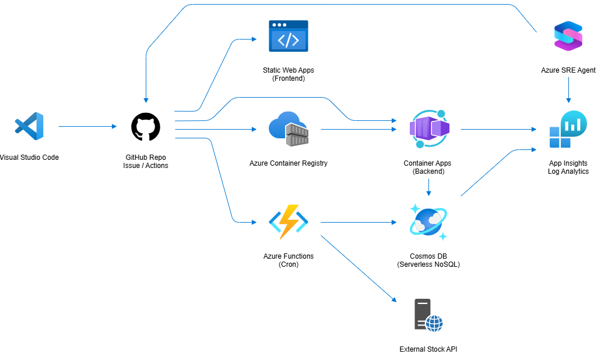

# MyStock App

[](https://codespaces.new/HyounsooKim/mystock)

> 이 저장소는 **GitHub Copilot을 활용한 Agentic DevOps** 학습을 목적으로 제작된 실습용 애플리케이션입니다.  
> 실제 프로덕션 환경에서 개선이 필요한 부분들이 의도적으로 포함되어 있으며,  
> Azure 클라우드 환경으로의 배포를 간편하게 경험할 수 있도록 구성되었습니다.  

개인화된 주식 포트폴리오 관리 애플리케이션으로 미국 주식 시장을 지원합니다.  
  
  

**🚀 [GitHub Codespaces에서 바로 시작하기](.devcontainer/README.md)**

[Demo 접속](https://stock.hemtory.com/)  

## Architecture
  

## Features

- **워치리스트 관리**: 관심 주식 종목 추가/삭제 및 실시간 시세 확인
- **주식 상세 정보**: 현재가, 변동률, 거래량, 캔들스틱 차트 (5가지 기간 옵션)
- **급등락 종목**: 실시간 급등/급락/거래량 상위 종목 정보 (매시간 자동 갱신)
- **뉴스 피드**: 관련 뉴스 및 공시 정보 제공
 
- **포트폴리오 관리**: 3개의 포트폴리오("장기투자", "단기투자", "정찰병")에서 보유 종목 관리
- **손익 분석**: 실시간 평가액, 손익률, 수익률 계산
  

## Tech Stack

### Backend
- **Framework**: FastAPI (Python 3.11)
- **Database**: Azure Cosmos DB (Serverless NoSQL API)
- **Stock Data**: Alpha Vantage API
- **Authentication**: JWT with bcrypt
- **Testing**: pytest

### Azure Functions
- **Runtime**: Python 3.11 (Azure Functions v4)
- **Trigger**: Timer (NCRONTAB: `0 0 * * * *` - 매시간)
- **Purpose**: Alpha Vantage API에서 급등/급락/거래량 상위 종목 수집
- **Storage**: Cosmos DB `top_movers` collection
- **Hosting**: Consumption Plan (Y1)

### Frontend
- **Framework**: Vue 3 (Composition API)
- **UI Library**: Tabler Dashboard
- **Charts**: ECharts
- **Build Tool**: Vite
- **State Management**: Pinia
- **Testing**: Vitest

### Infrastructure
- **Cloud**: Azure
  - Cosmos DB (Serverless NoSQL)
  - Container Apps (Backend API)
  - Azure Functions (Data Collection)
  - Static Web Apps (Frontend)
  - Container Registry
  - Log Analytics + Application Insights
- **IaC**: Azure Bicep
- **CI/CD**: GitHub Actions

## Project Structure

```
mystock/
├── backend/                    # FastAPI 백엔드
│   ├── src/
│   │   ├── api/               # API 엔드포인트
│   │   ├── core/              # 설정, DB, 보안
│   │   ├── models/            # 데이터 모델
│   │   ├── schemas/           # Request/Response 스키마
│   │   ├── services/          # 비즈니스 로직
│   │   └── main.py            # FastAPI 진입점
│   ├── tests/                 # 테스트 코드
│   └── Dockerfile             # 컨테이너 이미지
│
├── backend/functions/          # Azure Functions (급등락 데이터 수집)
│   ├── function_app.py        # Timer Trigger 함수
│   └── requirements.txt       # Python 의존성
│
├── frontend/                   # Vue 3 프론트엔드
│   ├── src/
│   │   ├── components/        # Vue 컴포넌트
│   │   ├── views/             # 페이지 뷰 (Watchlist, Portfolio, TopMovers)
│   │   ├── stores/            # Pinia 스토어
│   │   └── router/            # Vue Router
│   ├── tests/                 # Vitest 단위 테스트 및 Playwright e2e 테스트
│   └── vite.config.js         # Vite 빌드 설정
│
├── infra/                      # Azure 인프라 (Bicep)
│   ├── main.bicep             # 메인 템플릿
│   └── modules/               # 모듈별 Bicep 파일
│
└── .github/workflows/          # CI/CD 파이프라인
```

## 배포가이드 문서

이 문서는 MyStock 애플리케이션을 Azure에 배포하는 전체 과정을 설명합니다.
자세한 배포 절차는 [DEPLOYMENT_GUIDE](./DEPLOYMENT_GUIDE.md) 파일에서 참고하세요.
로컬 개발 환경에서의 실행 방법은 [Local_Development_Guide.md](./Local_Development_Guide.md) 파일에서 참고하세요.  

## License

MIT License - See LICENSE file for details

## Support

For issues and questions, please create an issue in the repository.
