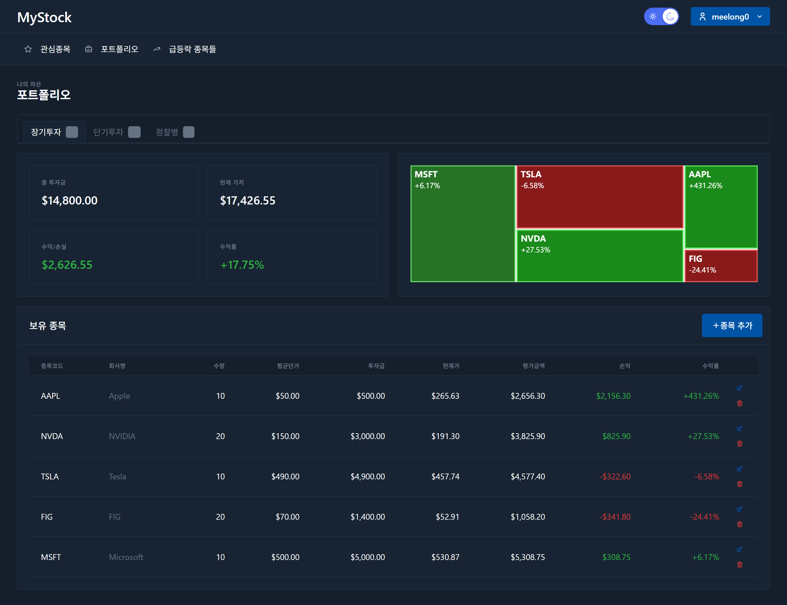

# MyStock - Personalized Stock Portfolio App

개인화된 주식 포트폴리오 관리 애플리케이션으로 미국(NYSE/NASDAQ) 주식 시장을 지원합니다.  
  
  

> 이 애플리케이션은 주식 앱의 간단한 기능만 들어가 있으며 개선할 포인트가 존재합니다.  
빠른 배포를 위해 Azure 환경에서 쉽게 배포할 수 있도록 구성되어 있습니다.  
(추후 Codespace로 실습할 수 있는 환경이 업데이트 될 예정입니다.)  

[Demo 접속](https://stock.hemtory.com/)  

## Architecture
```
┌────────────────────────────────────────────────────────┐
│ GitHub Repository                                      │
│ ├─ frontend/   → GitHub Actions → Static Web App       │
│ ├─ backend/    → GitHub Actions → Container Apps       │
│ └─ functions/  → GitHub Actions → Azure Functions      │
└────────────────────────────────────────────────────────┘
                          ↓
┌────────────────────────────────────────────────────────┐
│ Azure Resources                                        │
│                                                        │
│ ┌─────────────────┐  ┌──────────────────┐              │
│ │ Static Web App  │→ │ Container Apps   │              │
│ │ (East Asia)     │  │ (Korea Central)  │              │
│ │ Free SKU        │  │ Consumption      │              │
│ └─────────────────┘  └──────────────────┘              │
│          ↓                    ↓                        │
│ ┌──────────────────────────────────────┐               │
│ │ Cosmos DB (Korea Central)            │               │
│ │ Serverless NoSQL API                 │               │
│ │ ├─ users collection                  │               │
│ │ └─ top_movers collection             │               │
│ └──────────────────────────────────────┘               │
│                    ↑                                   │
│ ┌──────────────────┴───────────────────┐               │
│ │ Azure Functions (Korea Central)      │               │
│ │ Timer Trigger (매시간)               │               │
│ │ - Alpha Vantage API 호출             │               │
│ │ - 급등/급락/거래량 상위 종목 수집    │               │
│ └──────────────────────────────────────┘               │
│                                                        │
│ ┌──────────────────────────────────────┐               │
│ │ Container Registry (Korea Central)   │               │
│ │ Docker 이미지 저장소                 │               │
│ └──────────────────────────────────────┘               │
│                                                        │
│ ┌──────────────────────────────────────┐               │
│ │ Log Analytics + App Insights         │               │
│ │ (Korea Central)                      │               │
│ └──────────────────────────────────────┘               │
└────────────────────────────────────────────────────────┘

External Services:
┌──────────────────────────────────────┐
│ Alpha Vantage API                    │
│ - Real-time stock quotes             │
│ - Top gainers/losers/active          │
│ - Company information                │
└──────────────────────────────────────┘
```

## Features

- **워치리스트 관리**: 관심 주식 종목 추가/삭제 및 실시간 시세 확인
- **주식 상세 정보**: 현재가, 변동률, 거래량, 캔들스틱 차트 (5가지 기간 옵션)
- **급등락 종목**: 실시간 급등/급락/거래량 상위 종목 정보 (매시간 자동 갱신)
- **뉴스 피드**: 관련 뉴스 및 공시 정보 제공
 
- **포트폴리오 관리**: 3개의 포트폴리오("장기투자", "단기투자", "정찰병")에서 보유 종목 관리
- **손익 분석**: 실시간 평가액, 손익률, 수익률 계산
  

## Tech Stack

### Backend
- **Framework**: FastAPI (Python 3.11)
- **Database**: Azure Cosmos DB (Serverless NoSQL API)
- **Stock Data**: Alpha Vantage API
- **Authentication**: JWT with bcrypt
- **Testing**: pytest

### Azure Functions
- **Runtime**: Python 3.11 (Azure Functions v4)
- **Trigger**: Timer (NCRONTAB: `0 0 * * * *` - 매시간)
- **Purpose**: Alpha Vantage API에서 급등/급락/거래량 상위 종목 수집
- **Storage**: Cosmos DB `top_movers` collection
- **Hosting**: Consumption Plan (Y1)

### Frontend
- **Framework**: Vue 3 (Composition API)
- **UI Library**: Tabler Dashboard
- **Charts**: ECharts
- **Build Tool**: Vite
- **State Management**: Pinia
- **Testing**: Vitest

### Infrastructure
- **Cloud**: Azure
  - Cosmos DB (Serverless NoSQL)
  - Container Apps (Backend API)
  - Azure Functions (Data Collection)
  - Static Web Apps (Frontend)
  - Container Registry
  - Log Analytics + Application Insights
- **IaC**: Azure Bicep
- **CI/CD**: GitHub Actions

## Project Structure

```
mystock/
├── backend/                    # FastAPI 백엔드
│   ├── src/
│   │   ├── api/               # API 엔드포인트
│   │   ├── core/              # 설정, DB, 보안
│   │   ├── models/            # 데이터 모델
│   │   ├── schemas/           # Request/Response 스키마
│   │   └── services/          # 비즈니스 로직
│   ├── tests/                 # 테스트 코드
│   └── Dockerfile             # 컨테이너 이미지
│
├── backend/functions/          # Azure Functions (급등락 데이터 수집)
│   ├── function_app.py        # Timer Trigger 함수
│   ├── services/              # Alpha Vantage 서비스
│   ├── requirements.txt       # Python 의존성
│   └── local.settings.json    # 로컬 개발 설정
│
├── frontend/                   # Vue 3 프론트엔드
│   ├── src/
│   │   ├── components/        # Vue 컴포넌트
│   │   ├── views/             # 페이지 뷰
│   │   ├── stores/            # Pinia 스토어
│   │   └── router/            # Vue Router
│   ├── public/
│   │   └── staticwebapp.config.json  # SWA 라우팅 설정
│   └── tests/                 # 테스트 코드
│
├── infra/                      # Azure 인프라 (Bicep)
│   ├── main.bicep             # 메인 템플릿
│   ├── modules/               # 모듈별 Bicep 파일
│   │   ├── cosmosdb.bicep
│   │   ├── containerapps.bicep
│   │   ├── functions.bicep
│   │   ├── staticwebapp.bicep
│   │   └── monitoring.bicep
│   └── quick-deploy.ps1       # 배포 스크립트
│
└── .github/
    └── workflows/              # CI/CD 파이프라인
        ├── deploy-backend.yml
        ├── deploy-frontend.yml
        └── deploy-functions.yml
```

## Data Flow: Top Movers Feature

급등락 종목 기능의 데이터 흐름:

```
┌─────────────────────────────────────────────────────────────┐
│ 1. Data Collection (Azure Functions - 매시간)              │
└─────────────────────────────────────────────────────────────┘
                          ↓
    ┌──────────────────────────────────────────┐
    │ Timer Trigger (0 0 * * * *)              │
    │ - Alpha Vantage API 호출                 │
    │ - TOP_GAINERS_LOSERS 엔드포인트          │
    └──────────────────────────────────────────┘
                          ↓
    ┌──────────────────────────────────────────┐
    │ Data Processing                          │
    │ - JSON 파싱                              │
    │ - 각 카테고리별 정렬                     │
    │ - 메타데이터 추가 (timestamp)            │
    └──────────────────────────────────────────┘
                          ↓
    ┌──────────────────────────────────────────┐
    │ Cosmos DB 저장                           │
    │ Collection: top_movers                   │
    │ Document ID: "latest"                    │
    │ - top_gainers (상위 20개)                │
    │ - top_losers (상위 20개)                 │
    │ - most_actively_traded (상위 20개)       │
    │ - last_updated: timestamp                │
    └──────────────────────────────────────────┘

┌─────────────────────────────────────────────────────────────┐
│ 2. Data Retrieval (Backend API)                            │
└─────────────────────────────────────────────────────────────┘
                          ↓
    ┌──────────────────────────────────────────┐
    │ GET /api/v1/stocks/top-movers            │
    │ - Cosmos DB에서 "latest" 문서 조회       │
    │ - 캐시된 데이터 반환                     │
    └──────────────────────────────────────────┘
                          ↓
    ┌──────────────────────────────────────────┐
    │ Response                                 │
    │ {                                        │
    │   "top_gainers": [...],                  │
    │   "top_losers": [...],                   │
    │   "most_actively_traded": [...],         │
    │   "last_updated": "2025-10-27T10:00:00Z" │
    │ }                                        │
    └──────────────────────────────────────────┘

┌─────────────────────────────────────────────────────────────┐
│ 3. Display (Frontend)                                       │
└─────────────────────────────────────────────────────────────┘
                          ↓
    ┌──────────────────────────────────────────┐
    │ TopMoversView.vue                        │
    │ - 3개 탭으로 구성                        │
    │ - 정렬 가능한 테이블                     │
    │ - 실시간 가격 포맷팅                     │
    │ - 변동률 색상 표시                       │
    └──────────────────────────────────────────┘
```

**장점**:
- ✅ Alpha Vantage API 호출 횟수 최소화 (시간당 1회)
- ✅ 사용자 요청 시 빠른 응답 (Cosmos DB 조회)
- ✅ 100만 사용자 시나리오에서도 비용 효율적
- ✅ Serverless 아키텍처로 자동 확장

## 배포가이드 문서

이 문서는 MyStock 애플리케이션을 Azure에 배포하는 전체 과정을 설명합니다.  
[DEPLOYMENT_GUIDE](./DEPLOYMENT_GUIDE.md) 파일에서 참고


## License

MIT License - See LICENSE file for details

## Support

For issues and questions, please create an issue in the repository.
